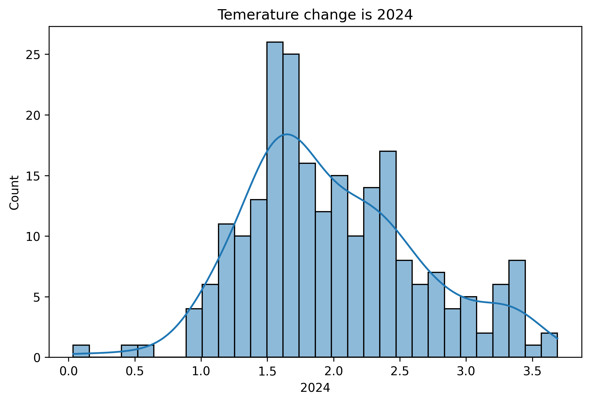
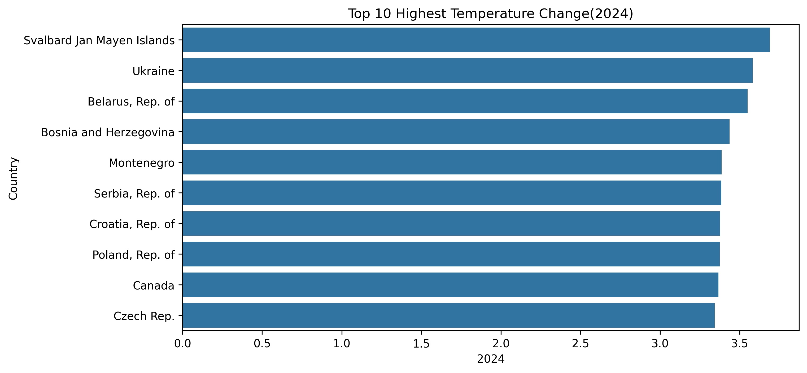
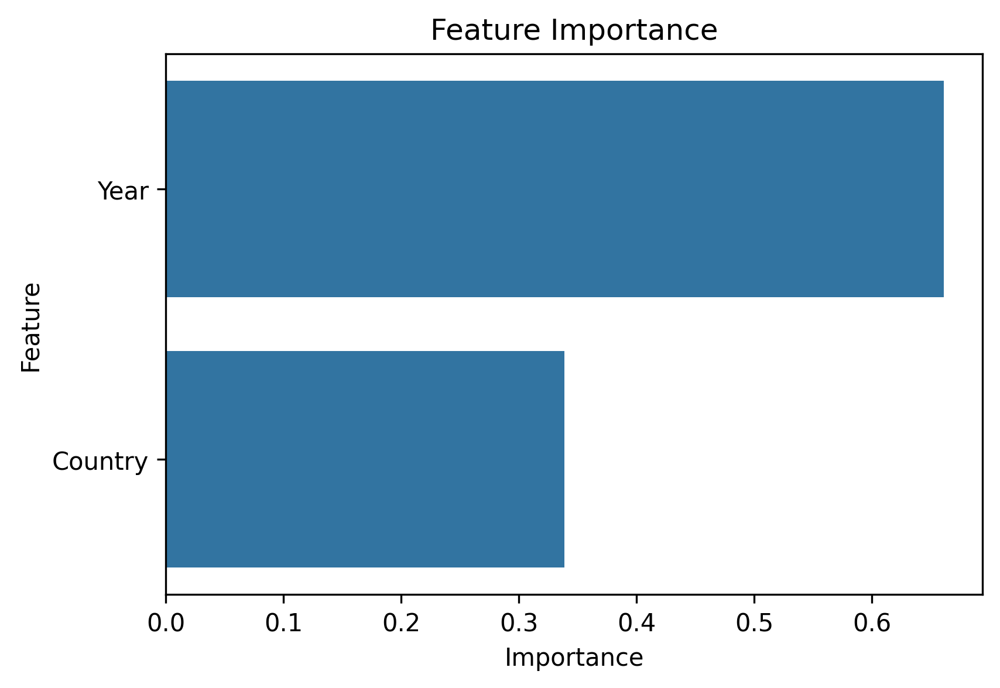
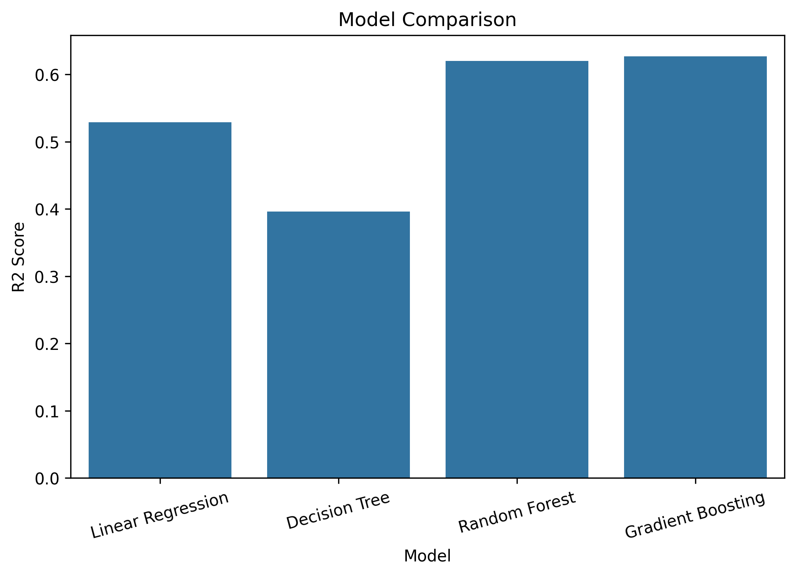
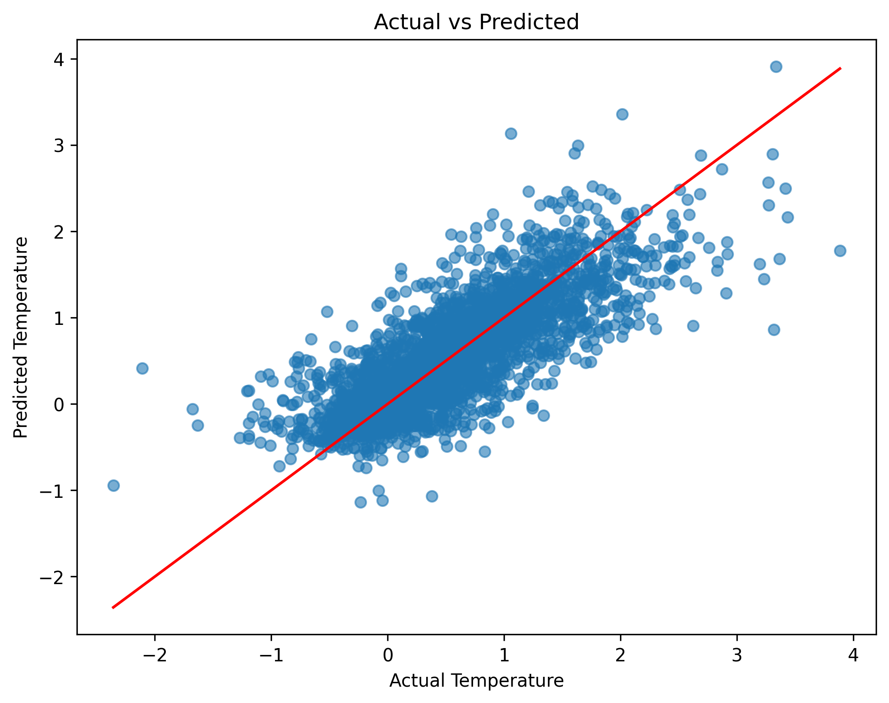

# 🌍 Climate Temperature Anomaly Prediction using Machine Learning

## 📌 Project Overview

Climate change is one of the biggest global challenges. This project uses historical climate temperature data (1961–2024) to analyze temperature anomalies and build a machine learning model that predicts temperature changes across different countries.

Multiple regression models were trained and compared to identify the best-performing model.

---

## 🎯 Project Objectives

- Analyze historical climate temperature data.
- Perform data cleaning and preprocessing.
- Explore temperature trends using visualizations.
- Build multiple regression models.
- Compare model performance.
- Select the best model for prediction.

---

## 📂 Dataset Information

- **Dataset:** Climate Temperature Anomaly Data
- **Years Covered:** 1961–2024
- **Countries/Regions:** 200+
- **Target Variable:** Temperature Change (°C)

---

## 🛠️ Technologies Used

- Python
- Pandas
- NumPy
- Matplotlib
- Seaborn
- Scikit-learn
- Joblib
- Kaggle Notebook

---

## 🔍 Data Preprocessing

The following preprocessing steps were performed:

- Removed unnecessary columns
- Checked missing values
- Removed duplicate records
- Converted data from wide format to long format
- Encoded country names using LabelEncoder
- Prepared features and target variables

---

## 📊 Exploratory Data Analysis (EDA)

The following visualizations were created:

- Temperature Distribution
- Top 10 Highest Temperature Change (2024)
- Feature Importance
- Model Comparison
- Actual vs Predicted Values

---

# 📸 Project Visualizations

## 🌡️ Temperature Distribution (2024)



---

## 🌍 Top 10 Highest Temperature Change (2024)



---

## 📈 Feature Importance



---

## 🤖 Model Comparison



---

## 🎯 Actual vs Predicted



---

# 🤖 Machine Learning Models

The following regression models were trained and compared:

- Linear Regression
- Decision Tree Regressor
- Random Forest Regressor
- Gradient Boosting Regressor

---

# 🏆 Best Performing Model

**Random Forest Regressor**

It achieved the highest performance among all the models and was selected as the final model.

### 📊 Model Performance

| Metric | Score |
|---------|-------|
| MAE | 0.312 |
| RMSE | 0.429 |
| R² Score | 0.620 |

---

# 📁 Project Structure

```
climate-change-temperature-anomaly-prediction/
│
├── climate_prediction.ipynb
├── climate_data.cvs.csv
├── cleaned_climate_data.csv
├── climate_temperature_model.pkl
├── README.md
└── images/
    ├── temperature_change_2024.png
    ├── top10_highest_temperature_change_2024.png
    ├── feature_importance.png
    ├── model_comparison.png
    └── actual_vs_predicted.png
```

---

# 🚀 Future Improvements

- Hyperparameter Tuning
- XGBoost Regressor
- LightGBM Regressor
- Time Series Forecasting
- Deep Learning Models (LSTM)

---

# 💡 Key Learnings

Through this project, I learned:

- Data Cleaning
- Feature Engineering
- Exploratory Data Analysis (EDA)
- Data Visualization
- Machine Learning Regression
- Model Comparison
- Model Evaluation
- Saving Machine Learning Models

---

# 👩‍💻 Author

**Humaira Siddique**

- GitHub: https://github.com/HumairaSiddique

---

## ⭐ If you found this project useful, please consider giving it a star on GitHub!
